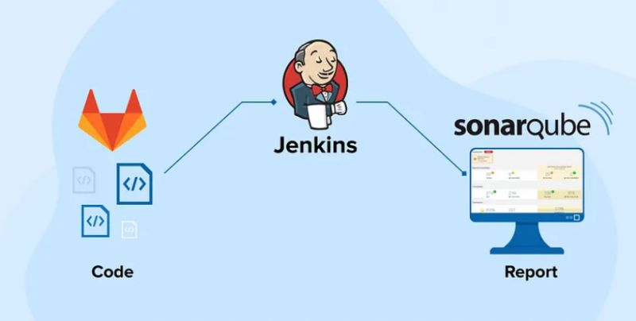
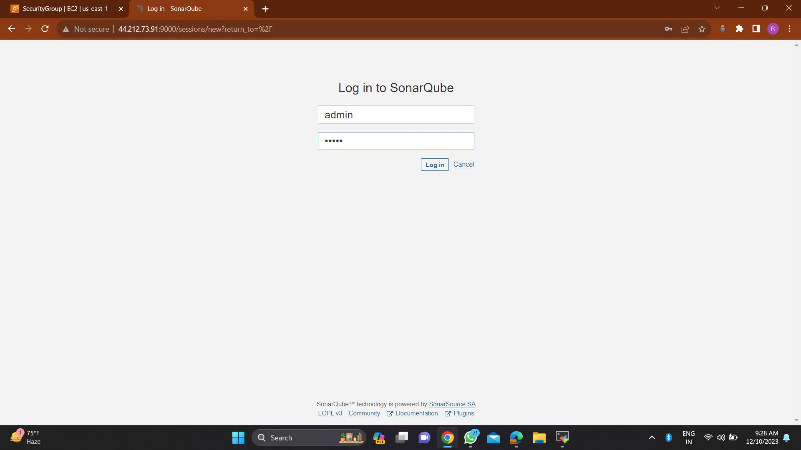
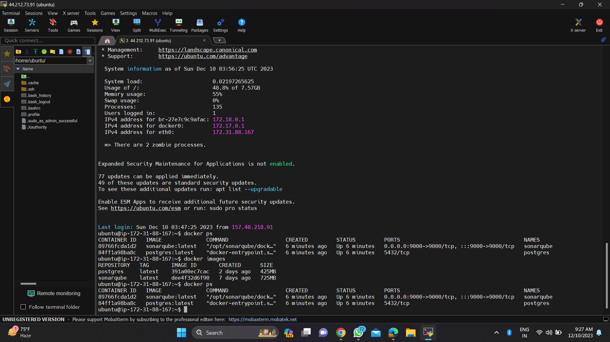
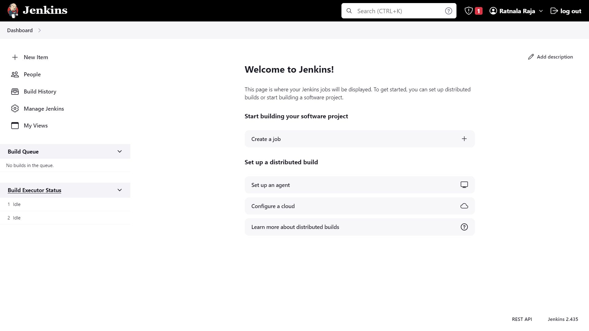
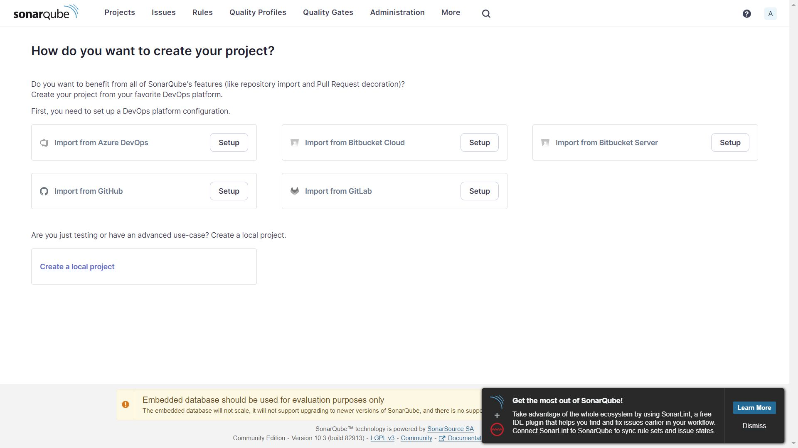
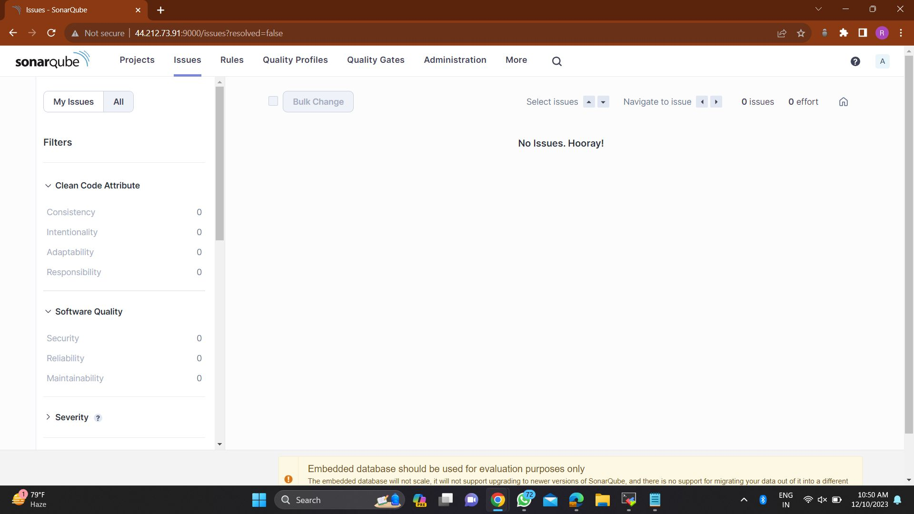

# Project-Expert-Engine
SonarQube is an open-source platform designed to continuously inspect code quality and security in software development projects. It offers a comprehensive set of tools for static code analysis, providing insights into code issues, bugs, vulnerabilities, and code smells.

# SonarQube-Jenkins_Integration

SonarQube-Jenkins Integration is a repository that demonstrates how to integrate SonarQube with Jenkins for automated code quality analysis. This project provides a step-by-step guide and code samples to help you set up SonarQube and Jenkins in your development environment.

## Table of Contents

- [Introduction](#introduction)
- [Prerequisites](#prerequisites)
- [Setup](#setup)
- [Usage](#usage)
- [Contributing](#contributing)
- [License](#license)

## Introduction

Ensuring high code quality and security is essential for successful software projects. This repository demonstrates how to leverage SonarQube, an indispensable platform for code analysis, and integrate it seamlessly with Jenkins to automate code quality checks. Whether you're looking to improve code integrity, reduce vulnerabilities, or ensure project success, this guide provides a solid foundation to get started.

## Prerequisites

Before you begin, ensure you have the following prerequisites in place:

- Docker installed on your system.
- Jenkins installed on your system.
- Basic knowledge of Docker and Jenkins.
- An active SonarQube instance (local or remote).

## Setup

### Install SonarQube Using Docker:

**Pull the SonarQube Docker image:**

docker pull sonarqube
Run the SonarQube container:

docker run -d --name sonarqube -p 9000:9000 sonarqube
Access SonarQube:
Open your browser and go to http://localhost:9000. The default login credentials are:

Username: admin
Password: admin

Install Jenkins:
Follow the installation guide on the official Jenkins website.

Install SonarQube Scanner Plugin in Jenkins:
Navigate to Manage Jenkins > Manage Plugins.
Go to the Available tab, search for SonarQube Scanner, and install it.

Configure SonarQube in Jenkins:
Go to Manage Jenkins > Configure System.
Scroll to the SonarQube Servers section.
Click Add SonarQube and enter your SonarQube details (Server URL, Authentication Token).

Configure Jenkins Job:

Create a new Jenkins job or configure an existing one.

Under the Build section, add Execute SonarQube Scanner as a build step.

Configure the necessary analysis properties. For a typical Maven project, the properties might look like:

sonar.projectKey=myproject
sonar.sources=src
sonar.java.binaries=target/classes

Test the Setup:

Test the integration by triggering a Jenkins build and ensuring that the SonarQube analysis is performed correctly.

Usage
Once the setup is complete, you can start using the SonarQube and Jenkins integration to automate code quality analysis. Here are some common use cases:

Automated Code Quality Checks:

Automatically trigger code quality checks with every build, ensuring continuous feedback.
Detect and Fix Issues Early: Identify code smells, bugs, and vulnerabilities before they become problems in production.
Maintain High Code Standards: Enforce coding standards and best practices across your team.
Please refer to the documentation and code samples for more details on how to integrate and use this setup in your specific scenario.

Contributing
Contributions to this project are welcome! If you have improvements, bug fixes, or new features to suggest, please open an issue or submit a pull request. Make sure to follow the contributing guidelines.

License
This project is licensed under the MIT License. You are free to use, modify, and distribute this project as per the terms of the license.

Disclaimer: This project is for educational and demonstration purposes. Be mindful of your resources and consider best practices for security and privacy when handling code and data.

